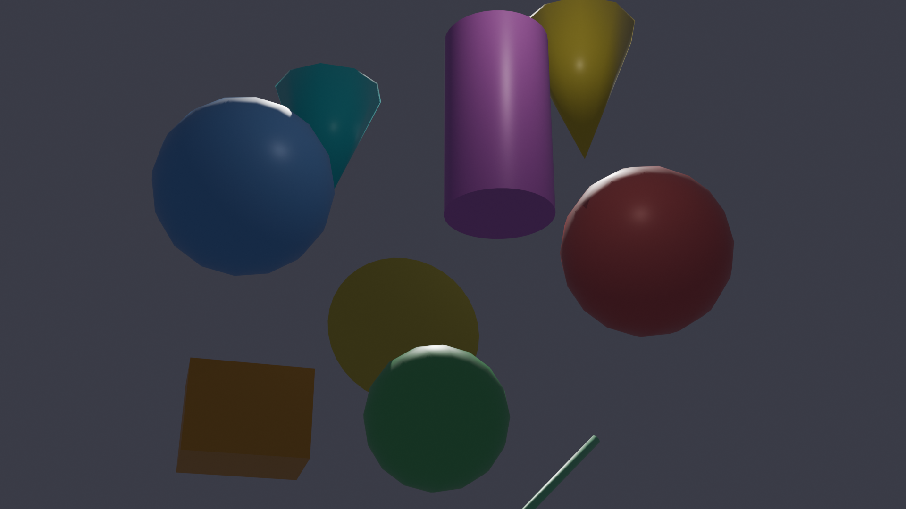
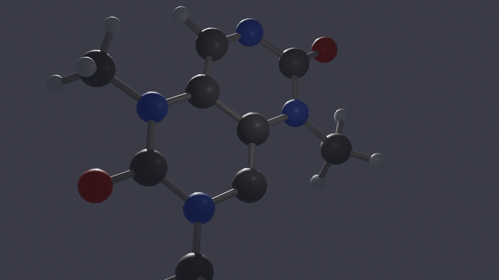
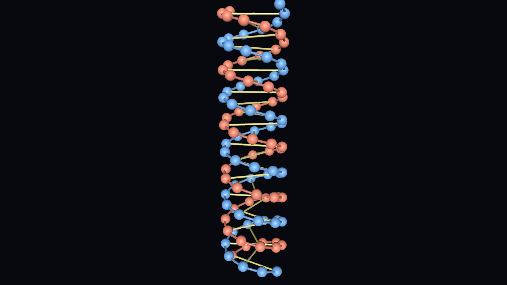
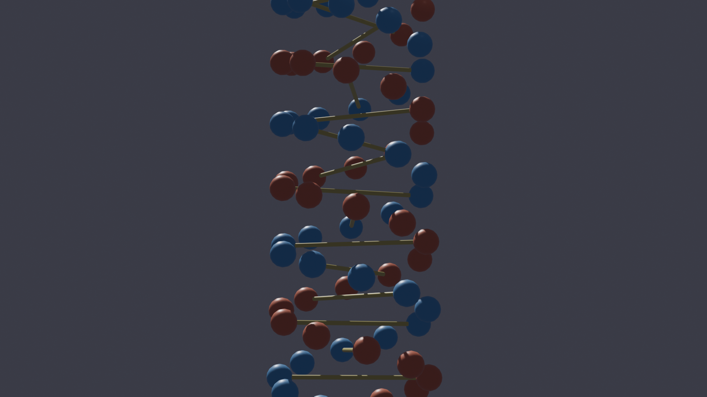

# FURY → Blender Export Pipeline (Proof of Concept)

> GSoC 2026 proof-of-concept for [Project 4: Exporting FURY Scenes and Animations to Blender](https://github.com/fury-gl/fury/wiki/Google-Summer-of-Code-2026#project-4-exporting-fury-scenes-and-animations-to-blender-for-advanced-rendering)

## Results

### Scene 1: Primitives

| FURY | Blender (EEVEE) |
|---|---|
|  |  |

### Scene 2: Caffeine Molecule (Ball-and-Stick)

| FURY | Blender (EEVEE) |
|---|---|
|  |  |

### Scene 3: DNA Double Helix

| FURY | Blender (EEVEE) |
|---|---|
|  |  |

## How to run

### Prerequisites

- Python 3.9+
- [FURY v2](https://github.com/fury-gl/fury/tree/v2) (must be installed from the `v2` branch — `pip install fury` won't work as it installs the stable VTK-based version)
  ```bash
  git clone -b v2 https://github.com/fury-gl/fury.git
  cd fury
  pip install -e ".[dev]"
  ```
- [Blender](https://www.blender.org/download/) 4.0+ (must be accessible via `blender` CLI command)
- NumPy

> **For reviewers:** The core pipeline is in [`create_fury_scene.py`](scenes/create_fury_scene.py) (geometry extraction) and [`import_to_blender.py`](import_to_blender.py) (Blender recreation). To see the results without running anything, open the `.blend` files in `converted-blend-files/` directly in Blender, or view the side-by-side screenshots above.

### Steps

**Step 1: Create FURY scenes and export geometry**
```bash
python scenes/create_fury_scene.py        # Primitives
python scenes/create_molecular_scene.py   # Caffeine molecule
python scenes/create_helix_scene.py       # DNA helix
```

**Step 2: Import into Blender and render**
```bash
blender --background --python import_to_blender.py -- scene_data.json
blender --background --python import_to_blender.py -- molecular_scene_data.json
blender --background --python import_to_blender.py -- helix_scene_data.json
```
Renders are saved to `screenshots/` and `.blend` files to `converted-blend-files/`.

**Step 3 (optional): Open in Blender GUI**
```bash
blender converted-blend-files/molecular.blend
```

## Architecture

```
FURY Scene (pygfx)          Export Pipeline           Blender Scene
┌──────────────┐     ┌─────────────────────┐     ┌──────────────────┐
│ Scene         │     │                     │     │ Scene             │
│  ├─ Camera    │────▶│  *_scene_data.json  │────▶│  ├─ Camera        │
│  ├─ Actors    │     │  (vertices, faces,  │     │  ├─ Mesh + Mat    │
│  │  (Mesh,    │     │   vertex colors,    │     │  ├─ Mesh + Mat    │
│  │   Sphere,  │     │   camera, transforms│     │  ├─ Sun Light     │
│  │   Cylinder,│     │   )                 │     │  ├─ Fill Light    │
│  │   ...)     │     └─────────────────────┘     │  └─ Rim Light     │
└──────────────┘                                   └──────────────────┘
```

## Known limitations (POC scope)

- Static scenes only — no animation export yet
- Basic material colors only — no textures, no PBR properties
- Billboard actors (impostor spheres) are excluded — only real mesh geometry is exported
- No light export from FURY — Blender lights are manually added
- Coordinate transform may need refinement for rotations/quaternions

## Author

**Jigyasu Rajput** — GSoC 2025 contributor (Python Software Foundation)
[GitHub](https://github.com/JigyasuRajput) | Currently contributing to fury-gl/fury (5 PRs on v2 branch)
